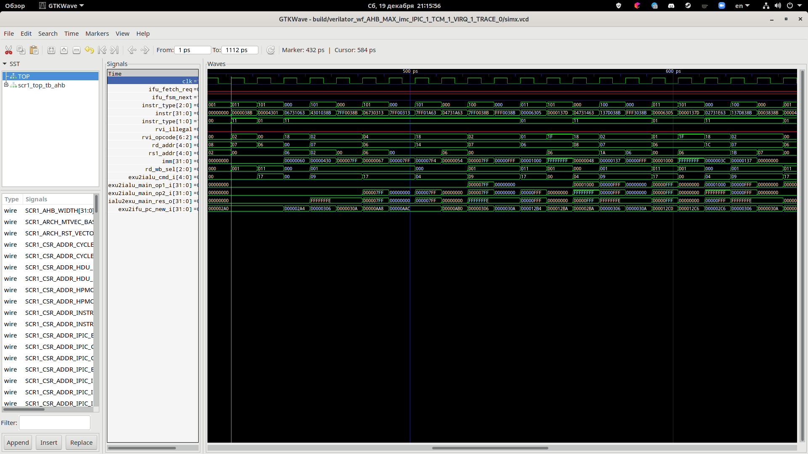
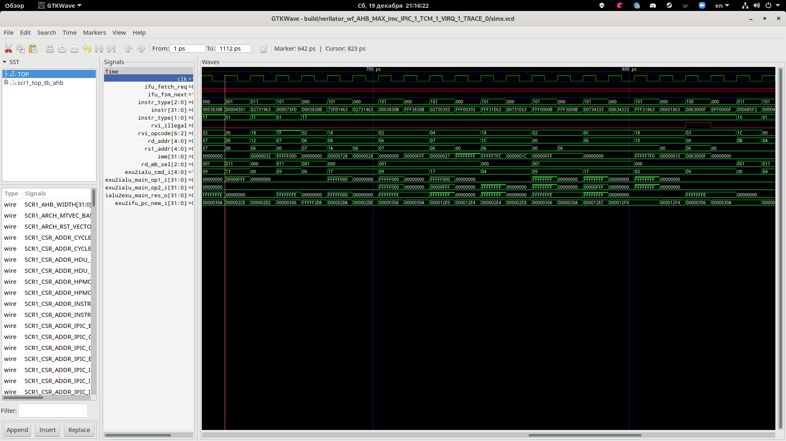

# Лабораторная работа Lab3 SCR1 RTL
## Цель
Исследование микроархитектуры и расширение функционала процессора SCR1

## Задание
| Вариант | Инструкция | Описание |
|---|---|---|
| 15 | Concatenation with immediate (`CNCI`) | `CNCI`: Конкатенация старших 20-bit регистра `RS1` и младших 12-bit константы, результат поместить в `RD` |

В вашем репозитории SCR1 от главной ветки master создать новую ветку с именем lab_rtl. В этой ветке вы можете коммитить все изменения проекта для данной лабораторной.

Убедитесь, что проект собирается и все тесты проходят в симуляции до внесения изменений в проект. Также убедитесь, что вы можете посмотреть вейвформы симуляции. Если вы используете Verilator в качестве симулятора, то для данной лабораторной вам нужно будет запускать его в режиме с генерацией вейвформ (`run_verilator_wf`).

Создайте в директории `./results` файл `README.md` с отчетом по проделанной работе. В отчете обязательно указать свой вариант задания.

### Добавление кастомной инструкции

1. Добавить в исходный код ядра новую кастомную инструкцию в соответствии с вариантом задания.
1. Способ машинного кодирования новой инструкции (расположение полей и значения opcode, funct и пр.) необходимо выбрать самостоятельно из области незарезервированных в RISC-V ISA опкодов. В отчете объяснить ваш выбор кодирования инструкции.
1. Поясните в виде блок-схемы или словесного описания в отчете какие изменения вы внести, в какие блоки и почему именно так.

Верификация

1. Написать ассемблерный тест для проверки новой инструкции. Так как компилятор ничего не знает о вашей кастомной инструкции, вместо мнемонического представления следует задавать ее как

        .word <инструкция в машинном коде> // комментарий с расшифровкой или мнемоникой

1. Тест должен покрывать несколько типичных случаев, в которых возможна ошибка. Поясните в отчете каждый выбранный вами типичный случай, на сколько хорошее тестовое покрытие будет обеспечено этим тестом.
1. Для отладки вы можете пользоваться Waveform (просмотр уровней внутренних сигналов rtl схемы), Dump, Tracelog. Приложите эти файлы в директорию ./results. Выведите на Waveform основные сигналы, которые показывают правильность прохождения инструкции по конвейеру - поясните в отчете ваш выбор.

## Выполнение
1. Запустил `make clean; make`, чтобы убедиться, что успешно проходят все тесты.
1. Создал файл `dependencies/riscv-tests/MyTest.S`:

        #include "riscv_test.h"

        RVTEST_RV32U

        RVTEST_CODE_BEGIN
                la      t0, testdata
                lw      t1, 0(t0)
                addi    t1, t1, 1
                la t0, result
                sw      t1, 0(t0)
                li      t3, 42
                bne     t1, t3, fail
                RVTEST_PASS
        fail:
                RVTEST_FAIL
        RVTEST_CODE_END

        .data
                .align 3
        testdata:
                .dword 41

        RVTEST_DATA_BEGIN
                .align 3
            result:
                .dword -1
        RVTEST_DATA_END

1. Добавил строку 68: `rv32_isa_tests = MyTest.S` к `sim/tests/riscv_isa/rv32_tests.inc`.
1. Запустил `make clean; make TARGETS=riscv_isa`, чтобы убедиться, что успешно проходит
    тест `MyTest`.
1. Заменил `li x3, 42` на `li x3, 43` в `MyTest.S` и убедился, что тест не проходит.
    В дальнейшем этот тест будет заменен на тест синтезируемой команды.
1. Решил использовать вид кодирования "I" (I-type),
    поскольку моя инструкция принимает регистр и младшие 12 бит константы на вход
    и регистр на выход.
    Аналогичные виды кодирования используют инструкции по типу `addi`,
    но добавить свою инструкцию в тот же `opcode` не получилось,
    т.к. все возможные значения `funct3` на `opcode = 0010011` уже распределены.
    Поэтому нужно выделить новый `opcode`.
1. Нашел неиспользуемый в RISC-V `opcode` 0001011.
    Последние два бита отвечают за тип машинной команды,
    а именно &mdash; 32-битная инструкция (RVI),
    остальные можно перебирать, что я и сделал.
1. Заменил строку 36 на строки 36-37 в файле `src/core/includes/scr1_riscv_isa_decoding.svh`:

        SCR1_OPCODE_SYSTEM  = 5'b11100,
        SCR1X_OPCODE_OP_IMM = 5'b00010
1. Добавил строки 87-88 в файле `src/core/includes/scr1_riscv_isa_decoding.svh`:

        ,
        SCR1X_IALU_CMD_CAT
1. Изменил строки 55 и 57 в файле `src/core/includes/scr1_riscv_isa_decoding.svh`:

        `ifdef SCR1_RVM_EXT
        localparam SCR1_IALU_CMD_ALL_NUM_E    = 24;
        `else // ~SCR1_RVM_EXT
        localparam SCR1_IALU_CMD_ALL_NUM_E    = 16;
1. Добавил строки 466-479 в файле `src/core/pipeline/scr_pipe_idu.sv`

        SCR1X_OPCODE_OP_IMM: begin
            idu2exu_use_rs1_o         = 1'b1;
            idu2exu_use_rd_o          = 1'b1;
            idu2exu_use_imm_o         = 1'b1;
            idu2exu_cmd_o.imm         = {{20{0}}, instr[31:20]};
            idu2exu_cmd_o.ialu_op     = SCR1_IALU_OP_REG_IMM;
            idu2exu_cmd_o.rd_wb_sel   = SCR1_RD_WB_IALU;

            case (funct3)
                3'b000: idu2exu_cmd_o.ialu_cmd = SCR1X_IALU_CMD_CAT;
                default: rvi_illegal = 1'b1;
            endcase // funct3
        end // SCR1X_OPCODE_OP_IMM

    Этот код, по аналогии с обработчиком `SCR1_OPCODE_OP_IMM`,
    декодирует команду как использующую один исходный регистр,
    один регистр для вывода, константу,
    задает младшие 12 бит константы как старшие 12 бит инструкции,
    старшие 20 бит константы заполняет нулями,
    режим ввода АЛУ как "регистр-константа",
    решим вывода АЛУ как "writeback" (запись в регистр после выполнения),
    операция в АЛУ &mdash; объявленная операция конкатенации.

    В случае, если установлен неправильный `funct3`,
    то устанавливается сигнал, что инструкция некорректна.
1. Добавил строки 652-655 в файле `src/core/pipeline/scr1_pipe_ialu.sv`:

        SCR1X_IALU_CMD_CAT: begin
            ialu2exu_main_res_o[31:12] = exu2ialu_main_op1_i[31:12];
            ialu2exu_main_res_o[11:0] = exu2ialu_main_op2_i[11:0];
        end
    Это реализация операции конкатенации в АЛУ.
1. Заменил код теста `MyTest.S`:

        #include "riscv_test.h"

        RVTEST_RV32U

        RVTEST_CODE_BEGIN
                /* Тривиальный вариант: конкатенация нулей с нулями */
                .word 0x0000038B /* 12{0}, x0, 000, t2 (x7), 0001011 ; cnci t2, x0, 0 */
                li t1, 0x000
                bne t1, t2, fail

                /* Теперь с единицами */
                .word 0x7FF0038B /* 0+11{1}, x0, 000, t2 (x7), 0001011 ; cnci t2, t1, 0xFFF */
                li t1, 0x000007FF
                bne t1, t2, fail

                /* Проверка, что старший бит константы не расширяется знаково */
                .word 0xFFF0038B /* 0+11{1}, x0, 000, t2 (x7), 0001011 ; cnci t2, t1, 0xFFF */
                li t1, 0x00000FFF
                bne t1, t2, fail

                /* Чтение из t1, а не x0 */
                .word 0xFFF3038B /* 0+11{1}, t1 (x6), 000, t2 (x7), 0001011 ; cnci t2, t1, 0xFFF */
                li t1, 0x00000FFF
                bne t1, t2, fail

                /* Чтение и запись в t2, проверка затирания единиц нулями */
                .word 0x0003838B /* 12{0}, t2, 000, t2, 0001011 ; cnci t2, t2, 0 */
                li t1, 0x00000000
                bne t1, t2, fail

                /* Проверка сохранения старшей части регистра, чтение из t2, запись в t1 */
                li t2, 0xFFFFF000
                .word 0x0003830B /* 12{0}, t2 (x7), 000, t1 (x6), 0001011 ; cnci t1, t2, 0 */
                bne t1, t2, fail

                /* И если записывать единицы тоже */
                .word 0xFFF3830B /* 12{1}, t2 (x7), 000, t1 (x6), 0001011 ; cnci t1, t2, 0 */
                li t2, 0xFFFFFFFF
                bne t1, t2, fail

                /* Запись в x0 дает 0 */
                .word 0xFFF3000B /* 12{1}, t1 (x6), 000, x0, 0001011 ; cnci x0, t1, 0xFFF */
                xor t1, t1, t1 /* Нельзя проверять через сам x0 */
                bne x0, t1, fail

                RVTEST_PASS
        fail:
                RVTEST_FAIL
        RVTEST_CODE_END

        RVTEST_DATA_BEGIN
        RVTEST_DATA_END

    Этот тест обеспечивает покрытие чтения и записи из разных регистров,
    чтения и записи в один регистр, чтения из `x0`, записи в `x0`,
    затирание нулями, затирание единицами кроме старшей
    (проверку того, что она не интерпретируется как знаковая),
    затирание единицами вместе со старшей,
    копирование нулей из регистра, копирование единиц из регистра.

    Стоит понимать, что полное тестовое покрытие обеспечить невозможно,
    поэтому нужно выбирать некоторый набор типичных и крайних случаев,
    что я и сделал.
1. Запустил `make clean; make TARGETS=riscv_isa`, чтобы убедиться, что тест проходит:

            Test   | build | simulation
        MyTest.hex    OK        PASS
1. Запустил `make clean; make TARGETS=riscv_isa run_verilator_wf`,
    для генерации waveform.
1. Запустил `gtkwave build/verilator_wf_AHB_MAX_imc_IPIC_1_TCM_1_VIRQ_1_TRACE_0/simx.vcd`
    для анализа waveform: 
     
     
    Как можно видеть, при `rvi_opcode = 2 (0b00010)`
    из `instr` извлекается `rd_addr`, `rs1_addr`, `imm`.
    После этого (не на том же такте) `exu2ialu_cmd_i` устанавливается в `0x17` (23),
    `exu2ialu_main_op1_i` устанавливается в значение `rs1`, а
    `exu2ialu_main_op2_i` &mdash; в `imm`.
    На этом же такте `ialu2exu_main_res_o` устанавливается в результат конкатенации
    и записывается в регистр `rd`.
1. Изменил строку 68: `rv32_isa_tests += MyTest.S` в `sim/tests/riscv_isa/rv32_tests.inc`.
1. Запустил `make clean; make`, чтобы убедиться, что все тесты проходят успешно.

## Вывод

Таким образом, SystemVerilog позволяет моделировать низкоуровневые операции на уровне сигналов,
например, моделировать процессор с архитектурой RISC-V и реализовывать машинные команды.
Сама архитектура RISC-V оставляет некоторые коды операций неиспользованными даже в расширениях,
поэтому можно добавить свои специфические для задачи инструкции.
